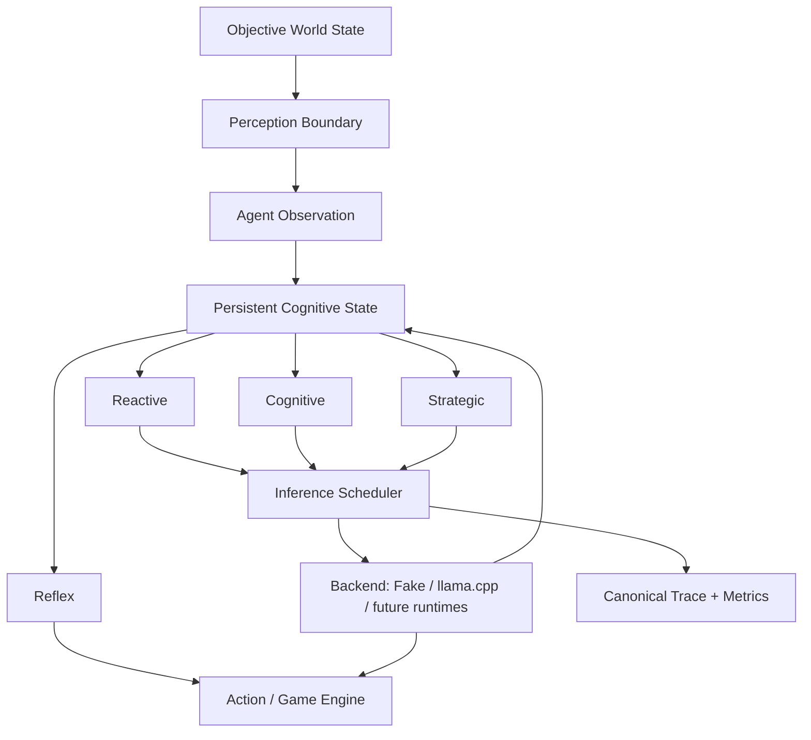

# GameAgentWorkload

**Experimental workload and benchmark harness for persistent, real-time AI agents in games.**

GameAgentWorkload asks a systems question rather than only an intelligence question:

> **What compute workload emerges when game agents must perceive, maintain state, adapt, reason, and act under real-time deadlines?**

The project is a **research prototype / open benchmark proposal**, not a finished benchmark standard and not a game engine. Its synthetic scenarios are intended to make assumptions measurable, criticizable, and replaceable.

## Why this exists

Current LLM benchmarks usually measure model quality, throughput, or request latency in isolation. A living game world introduces a different workload shape:

- many persistent agents, but only a small hot subset at any moment;
- bursty activation when world events occur;
- multiple cognition timescales;
- decisions that can become stale while inference is still running;
- world truth, perception, belief, and memory that must remain distinct;
- hard or soft real-time deadlines;
- competition for compute with rendering, physics, animation, audio, and other game systems.

GameAgentWorkload makes those pressures explicit and records them as replayable traces.

## Current status

**Public research preview — v0.5 alpha (Bedroom-1 experimental branch candidate).**

Implemented today:

- deterministic event-driven world simulation;
- persistent agent state and activation levels;
- perception boundaries (`world truth != agent knowledge`);
- structured cognition state (working memory, beliefs, intents, plans);
- provisional cognition, interruption, supersession, and replanning;
- layered workload: **reflex / reactive / cognitive / strategic**;
- priority/deadline scheduling;
- deterministic JSONL traces and replay digests;
- synthetic backend for reproducible systems experiments;
- real `llama.cpp` replay with exact token-count prompts;
- deadline decomposition: queue-induced vs intrinsic service misses;
- first real CPU baseline: i5-8250U + Qwen3.5-0.8B Q8_0, CPU-only;
- 17 original automated tests plus Bedroom-1 cognition/extension regressions.

Not implemented yet:

- GPU/NPU telemetry matrix;
- model routing per cognition layer;
- rendering/inference contention;
- real power / energy-per-decision measurements;
- standardized quality scoring for agent decisions;
- engine integration (Unreal/Unity/Godot);
- a validated universal definition of game-agent cognition.

## Architecture



The benchmark does **not** require reflex to be rule-based forever. `reflex`, `reactive`, `cognitive`, and `strategic` are workload contracts / latency classes. Future implementations may use rules, tiny neural policies, transformer action heads, SLMs, LLMs, or dedicated hardware as long as the implementation is measured transparently.

See [docs/ARCHITECTURE.md](docs/ARCHITECTURE.md) for the current design boundaries.

## Scenarios


### `bedroom_1_*`

The v0.5 Bedroom-1 family deliberately shrinks the world to one NPC beside one bed.
It studies whether automatic skill execution should continue or be interrupted under
four controlled deviations: normal sleep, a goal-surface obstruction, an imminent
projectile, and a consequential social interruption. The runtime separates
**interrupt justification** from **cognitive budget/depth** and evaluates behavioral
envelopes rather than one scripted action.

See [docs/BEDROOM_1_EXPERIMENTAL_CONTRACT.md](docs/BEDROOM_1_EXPERIMENTAL_CONTRACT.md).

### `saloon_64`

Historical baseline used to expose burst scheduling, interruption, and deadline behavior.

### `saloon_64_layered`

Introduces four cognition layers so immediate reactions do not have to wait for full high-level language-model completion.

The current saloon scenario is only a compact stress case. The long-term goal is a scenario suite spanning open-world NPCs, FPS teammates, RPG companions, crowds, RTS agents, survival agents, and persistent social/economic worlds.

## Quick start

Requires **Python 3.11+**. Synthetic runs use only the Python standard library.

```bash
python run.py run --scenario bedroom_1_roach --seed 7 --concurrency 1

# or the older layered stress scenario
python run.py run --scenario saloon_64_layered --seed 7 --concurrency 4
```

Run the complete Bedroom-1 core suite:

```bash
python run.py bedroom-suite --concurrency 1
```

Run the historical scenario:

```bash
python run.py run --scenario saloon_64 --seed 7 --concurrency 4
```

Run tests:

```bash
python -m pip install -e ".[dev]"
python -m pytest -q
```

Expected at this revision:

```text
23 passed
```

## Real llama.cpp replay

Start a separate `llama.cpp` server. Example CPU-only configuration:

```powershell
.\llama-server.exe `
  -m .\models\Qwen3.5-0.8B-Q8_0.gguf `
  --host 127.0.0.1 `
  --port 8080 `
  -c 2048 `
  --n-gpu-layers 0
```

Generate the canonical layered trace:

```powershell
python run.py run --scenario saloon_64_layered --seed 7 --concurrency 4
```

Replay a small reactive subset:

```powershell
python run.py replay-real traces\saloon_64_layered.trace.jsonl `
  --base-url http://127.0.0.1:8080 `
  --cognitive-layers reactive `
  --concurrency 1 `
  --max-requests 8 `
  --timing-mode immediate
```

The real replay report separates:

- end-to-end deadline miss;
- zero-queue/intrinsic service miss;
- queue-only miss;
- TTFT-after-deadline.

This prevents a slow model/hardware configuration from being misdiagnosed as merely a scheduler problem.

## First hardware baseline

The first preserved real replay is under:

```text
baselines/i5-8250U_qwen3.5-0.8B-Q8_0/
```

It is intentionally a **low-end CPU floor / plumbing baseline**, not a recommended target for future AI-native games. The important next matrix is representative gaming GPUs (for example RTX 3090 / 4090 / 5090) plus datacenter references such as A100/H100 to help isolate memory-bandwidth, capacity, scheduling, and decode characteristics.

See [docs/CLOUD_HARDWARE_PLAN.md](docs/CLOUD_HARDWARE_PLAN.md).

## Benchmark philosophy

GameAgentWorkload tries to keep these concepts separate:

1. **World correctness** — what is objectively true in the simulation.
2. **Agent information** — what a specific agent can actually observe or infer.
3. **Agent quality** — whether the chosen decision is intelligent or believable.
4. **Compute workload** — what inference/state/scheduling work that decision process creates.
5. **Hardware/runtime performance** — whether a concrete system can execute that workload under its deadlines.

A faster runtime does not make a bad agent intelligent, and a smarter model does not make an impossible latency contract feasible.

## We want criticism

This repository is being opened early on purpose. Useful criticism includes:

- unrealistic arrival processes or deadlines;
- bad assumptions about real game-engine workloads;
- better real-time scheduling formulations;
- cache/KV lifecycle issues we missed;
- rendering + inference contention;
- better cognition-layer definitions;
- scenario proposals from real games/engines;
- AMD / Intel / Apple / NPU backends;
- reproducible consumer-GPU benchmark results.

Please read [CONTRIBUTING.md](CONTRIBUTING.md) before proposing a scenario or hardware result.

## Repository layout

```text
awb/                  core world, cognition, scheduler, tracing, metrics
awb/backends/         synthetic and llama.cpp backends
scenarios/            benchmark scenarios
baselines/            preserved real hardware measurements
docs/                 architecture and hardware-testing notes
tests/                deterministic regression tests
traces/               canonical example traces/reports
run.py                 CLI entry point
```

## License

Apache-2.0. See [LICENSE](LICENSE).
